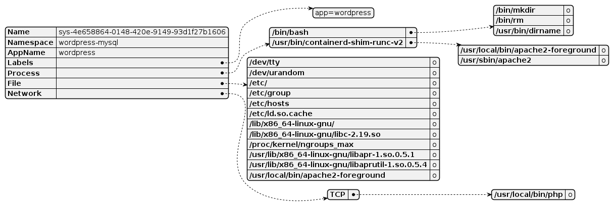
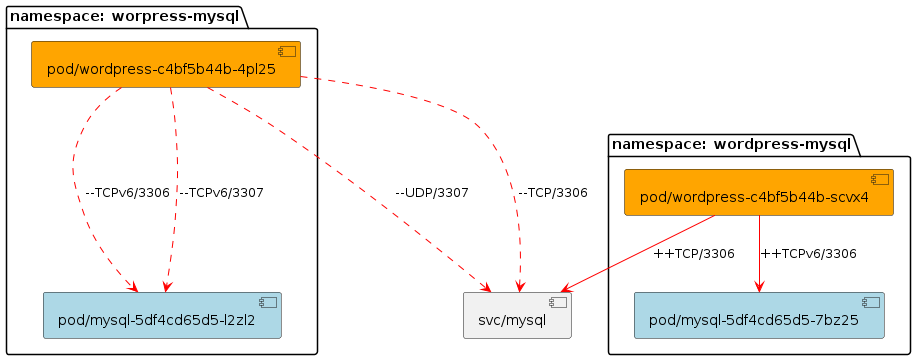

# KubeArmor Action
A Github Action component library that visualizes the application's system-level behaviors and network connection changes. For example, which processes are generated by the application and the parent-child relationship between processes, which file access is generated, which network connections are generated, network connection topology, network connection changes, and so on.

## How To Use

### Main Action: kubearmor-action
This action will be used to save the new app summary report and choose to generate visualisation results or not
```yaml
 # Save the new app summary report and Choose to Generate visualisation results or not
- name: Save the new app summary report and Choose to Generate visualisation results
  uses: kubearmor/kubearmor-action@main
  with:
    old-summary-path: 'https://raw.githubusercontent.com/kubearmor/kubearmor-action/main/test/testdata/old-summary-data.json'
    namespace: 'sock-shop'
    app-name: 'front-end'
    file: 'summary-test.json'
    visualise: 'true' # default value is true, if set false, will not generate visualisation results but only save the new app summary report
```
### Other Tool Actions
#### Action: install-kubearmor
This action will be used to install kubearmor-client and Discovery-Engine.
```yaml
# Install kubearmor components
- name: Install kubearmor components
  uses: kubearmor/kubearmor-action/actions/install-kubearmor@main
```
#### Action: check-pods-ready
This action will be used to check whether all pods are ready, if not, will show logs and events for troubleshooting.(This will need setup GO env first.)
```yaml
# Check all pods are ready, if not, get reason
- name: Check all pods are ready, if not, get reason
  uses: kubearmor/kubearmor-action/actions/check-pods-ready@main
```
#### Action: save-summary-report
This action will be used to save the summary report to specified file.
```yaml
# Save the app summary report
- name: Save the new app summary report
  uses: kubearmor/kubearmor-action/actions/save-summary-report@main
  id: save-summary-report
  with:
    namespace: 'sock-shop' # This is set for karmor summary -n $namespace command.(This must be set.)
    file: 'summary-test.json' # This is set for the name of the summary report file.(If not set, the default value is summary.json.)
```
#### Action: visual-report
This action will be used to visualize the system-level behaviors and the network connections changes.If the old-summary-path and new-summary-path are different, the network connection changes before and after are displayed. If they are the same, the network behavior of the specific application is displayed without changes.(This will setup JAVA env acquiescently.)
```yaml
- name: Kubearmor-action visualisation
  id: visualisation-report
  uses: kubearmor/kubearmor-action/actions/visual-report@main
  with:
    old-summary-path: 'https://raw.githubusercontent.com/kubearmor/kubearmor-action/main/test/testdata/old-summary-data.json' # This is set for old-summary-path, this can be set remote URL or local file path.(This must be set.)
    new-summary-path: '${{ github.workspace }}/${{ steps.save-summary-report.outputs.summary-report-file }}' # This is set for new-summary-path, this can be set remote URL or local file path.(This must be set.)
    namespace: 'sock-shop' # This is set for namespace of the application.(This must be set.)
    app-name: 'orders' # If set to non-empty, will show network connections of the pod containing the specified name. If not set or set none will show network connections of all pods.
```

### Complete Example
```yaml
name: test

on:
  push:
    branches: [main]
  pull_request:
    branches: [main]
permissions:
    pull-requests: write
    contents: write

jobs:
  test_job:
    runs-on: ubuntu-latest
    name: A job to test kubearmor-action
    steps:
      # Setup Go
      - name: Setup Go
        uses: actions/setup-go@v4
        with:
          go-version: '1.20'
        env:
          GOPATH: ${{ runner.workspace }}
          GO111MODULE: "on"

      # Checkout to your repo
      - name: Checkout
        uses: actions/checkout@v3

      # Install k3s cluster(You can setup a k8s cluster here)
      - name: Setup k3s cluster
        run: |
          curl -sfL https://get.k3s.io | K3S_KUBECONFIG_MODE="644" sh -s - --disable=traefik

          KUBEDIR=$HOME/.kube
          KUBECONFIG=$KUBEDIR/config
          [[ ! -d $KUBEDIR ]] && mkdir $KUBEDIR
          if [ -f $KUBECONFIG ]; then
            echo "Found $KUBECONFIG already in place ... backing it up to $KUBECONFIG.backup"
            cp $KUBECONFIG $KUBECONFIG.backup
          fi
          sudo cp /etc/rancher/k3s/k3s.yaml $KUBECONFIG
          sudo chown $USER:$USER $KUBECONFIG
          echo "export KUBECONFIG=$KUBECONFIG" | tee -a ~/.bashrc
          
          echo "wait for initialization"
          sleep 15

          runtime="15 minute"
          endtime=$(date -ud "$runtime" +%s)

          while [[ $(date -u +%s) -le $endtime ]]
          do
            status=$(kubectl get pods -A -o jsonpath={.items[*].status.phase})
            [[ $(echo $status | grep -v Running | wc -l) -eq 0 ]] && break
            echo "wait for initialization"
            sleep 1
          done
          kubectl get pods -A

      # Install kubearmor components(This will install KubeArmor components into the configured k8s cluster)
      - name: Install kubearmor components
        uses: kubearmor/kubearmor-action/actions/install-kubearmor@main
      - name: Get pod
        run: kubectl get po -A

      # Deploy the new app(You can deploy your application here)
      - name: Deploy the new app
        run: kubectl apply -f ./test/testdata/sock-shop.yaml

      # Check all pods are ready, if not, get reason
      - name: Check all pods are ready, if not, get reason
        uses: kubearmor/kubearmor-action/actions/check-pods-ready@main

      # Runs Integration/Tests/Load Generation(You can add a step here)
      # Generate load on the new app
      - name: Generate load on the new app
        run: docker run --net=host weaveworksdemos/load-test -h localhost:30001 -r 100 -c 2

      # Save the new app summary report and Choose to Generate visualisation results or not
      - name: Save the new app summary report and Generate visualisation results
        uses: kubearmor/kubearmor-action@main
        id: visualisation
        with:
          old-summary-path: 'https://raw.githubusercontent.com/kubearmor/kubearmor-action/main/test/testdata/old-summary-data.json'
          namespace: 'sock-shop'
          app-name: 'front-end'
          file: 'summary-test.json'
          visualise: 'true' # default value is true, if set false, will not generate visualisation results but only save the new app summary report

      # Get the visualisation results
      - uses: actions/download-artifact@v2
        with:
          name: ${{ steps.visualisation.outputs.visualisation-results-artifact }}
          path: images

      # Store the visualisation results
      - uses: peaceiris/actions-gh-pages@v3
        with:
          github_token: ${{ secrets.GITHUB_TOKEN }}
          publish_dir: ./images
          keep_files: true

      # Comment the visualisation results on the PR
      - name: Comment on PR
        run: |
          gh pr comment  ${{ github.event.number }} -b""
          gh pr comment  ${{ github.event.number }} -b""
        env:
          GITHUB_TOKEN: ${{ secrets.GITHUB_TOKEN }}
```

## Architecture Overview
```Shell
.
├── LICENSE
├── Makefile
├── README.md
├── actions
│   ├── check-pods-ready
│   │   ├── action.yml
│   │   └── main.go
│   ├── install-kubearmor
│   │   └── action.yml
│   ├── save-summary-report
│   │   └── action.yml
│   ├── setup-k3s-cluster
│   │   └── action.yml
│   └── visual-report
│       └── action.yml
├── cmd
│   └── visual
│       ├── cmd
│       │   ├── common.go
│       │   ├── network.go
│       │   ├── root.go
│       │   └── system.go
│       └── main.go
├── common
│   └── common.go
├── docs
│   └── pics
│       ├── network-connnections.png
│       └── sys-behaviors.png
├── examples
│   └── visualisation
│       └── main.go
├── go.mod
├── go.sum
├── hack
│   ├── LICENSE_TEMPLATE
│   └── install-k3s.sh
├── install
│   ├── k3s
│   │   └── install_k3s.sh
│   └── self-managed-k8s
│       └── crio
│           └── install_crio.sh
├── karmor
├── pkg
│   ├── controller
│   │   └── client
│   │       └── client.go
│   └── visualisation
│       ├── plantuml.jar
│       ├── types.go
│       └── visualisation.go
├── test
│   └── testdata
│       ├── new-summary-data.json
│       ├── old-summary-data.json
│       ├── sock-shop.yaml
│       └── wordpress-mysql.yaml
└── utils
    ├── exec
    │   └── exec.go
    ├── os
    │   ├── file.go
    │   ├── readers.go
    │   └── writers.go
    ├── urlfile
    │   └── urlfile.go
    └── utils.go
```

## Application Behaviors Visualisation
### System Behaviors

### Network Connections

