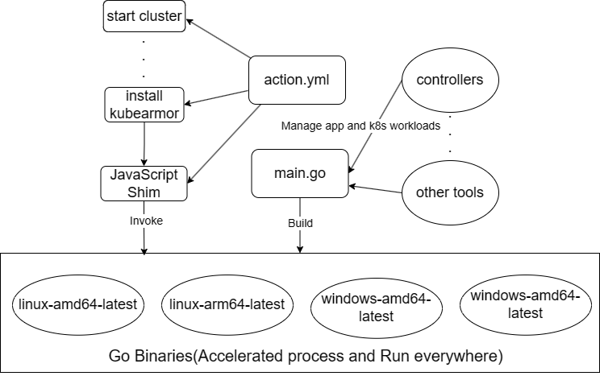

# kubearmor-action
A Github Action used to identify changes in the application posture. Such as what new processes are being spawned and what new file accesses are being made.

## How To Use
```yaml
name: example
on:
  push:
    branches: [main]
  pull_request:
    branches: [main]
jobs:
  example_job:
    runs-on: ubuntu-latest
    name: A job to test kubearmor-action
    steps:
      - name: kubearmor-action test
        uses: kubearmor/kubearmor-action@main
        with:
          old-app-image-name: 'nginx:1.22.1' # old app docker image name
          new-app-image-name: 'nginx:1.23' # new app docker image name
          filepath: '/tmp' # file path to store baseline and updated file (default is '/tmp')
```
## Architecture Overview
